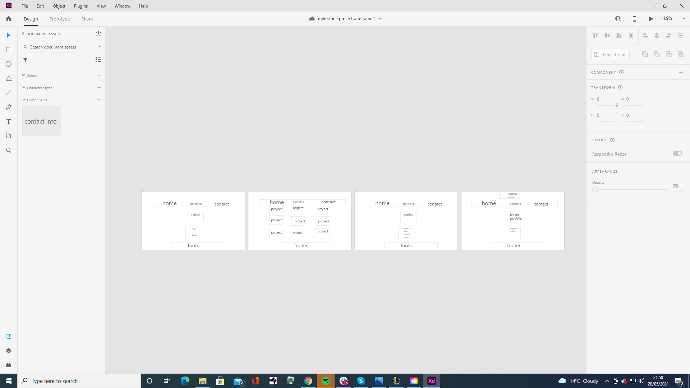

# MS-Project-one-JPT

 
 

## About

for my first MileStone project I wanted to do something simple, that would also allow me to apply the lessons I have learnt in CSS and html modules.
So I created a portfolio website for a graphics designer.

## Table of Content
* [ UX & UI](#my-ux-choices-and-my-ui-choices)
* [Features](#features)
* [Future Features](#future-features)
* [Tech Used](#technologies-used)
* [Testing](#testing)
* [Deployment](#deployment)

## my UX choices and my UI choices.
 
### user stories
*when a user comes to my site, I want my portfolio easily laid out and very easy to navigate. 

1.want the website easy to understand and the layout to be self explainatry.
2. I want it to be visually appealing with the layout so it looks clean and professional.

### UX justification. 
1. I wanted to create a clean looking website.
2. by doing this it allows the portfolio to create the colour.
3. by having a simple navigation it creates a pleasant user experience.
4. Having the main three pages target blank it makes it very easy to navigate through the whole site in three tabs
5. adding a hints of logo colours within the site allows the user to become familiar with the brand.
6. by adding in a portrait of the artist it creates a sense of safety as you know who it is you're working with

### UI Justification.
1.For my UI I have added colour changes to provide confirmation that the user is where they want to be for example on hover clickable parts will change colour.
2.I have created slow animations at .5s to provide a smooth transition.
3.I have added lots of line height for the text to allow the text to be easily legible. 

## Features.
1. I have a topnav that is very simple to use.
2. I have a flexbox layout of all the projects giving them two rows of 4 for desktop rows of 2 for tablets and 1 for phone.
3. it has a simple enquiry process with links ot social media at the bottom of every page.
4. a small bio for each portfolio project.  
5. Target_blanks have been left in on purpose to prove that I know how to use them. These will occur on the home page, and the portfolio page. When navigating to the contact page.

## design

* color scheme 
the main goal for this website was to keep it linked with the brand colors. These colors are; 
rgb(235, 98, 9);
rgb(74, 74, 73);
The way it is laid out is to have hints of these colors all across the website to tie it in with the logo.

* fonts
the main font within the body is Lato and secondary is sans-serif and headers are Oswald. 
This combo works really well and adds a level of sophistication and it is a very easy font to read.

* imagery
The images are everything in this website. The portrait shows familiarity with the graphic designer.
the portfolio itself needs to be a fair size so you can see the work as well as wanting to click on the portfolio.

* wireframes
Here are my wire frames they are very simple and not the best but it shows the basic layout of the website.

* top-nav - allows user to easily navigate across all pages
The header itself is positioned to always be visible, at the top of the screen (mobile and desktop) which allows visitors to find it quickly.

* colors have been used to be incorporated with the brand 

* Accessibility
All Pages have a description in case the image link breaks as well as helps screen readers.
### Future Features

The future holds many posibilities and I want to come back to this project. Do I know all the changes I would like to make to this website? No, but there are a few things
I would like to change and update;
 
 * I would like to add a interaction bar on either side of the webiste. 
 * I would like to actually impliment other langauges down the line to this project to make it more professional and ready for the real world

## Technologies used

[html 5]<https://en.wikipedia.org/wiki/HTML5>
 
[CSS3] <https://en.wikipedia.org/wiki/CSS>
[gitpod] <https://www.gitpod.io/>
[github] <https://github.com/>

## Testing

For testing I went through a few things like the transition animations just to make sure that they all did the thing I wanted to do which was for each one to do it seperatley
This was hard as putting the correct "
" in the right place was everything as the transition was targetting a class that the portfolio was built around.
One issue I am still having is trying to seperate the Text from the portfolio image so that when the Image is hovered the Image fades out but I want the text to fade in
So that it is more clear where to click to go to the next page for the portfolio selected.

Testing out the "<a>" making sure that they were linked all to the right place was just a simple case of making sure that they were all leading to the right hyperlinks.
And that the hyperlinks were fullfilling the purpose set to them, and making sure the right ones had the target="_blank" and the right ones simply sent you back to either
 the portfolio, contact or home page. Whilst others lead to seperate portfolios, it quickly became apparent that for this website to work I couldn't incorporate thirteen target 
 blanks as having thirteen tabs open for one singular portfolio website is far too much.
 

    

 all of my HTML files pass the HTML validator. it just didn't offer the same copy and paste valid sticker as it did for CSS.
 
 ## bugs
 There a no known bugs.
 
 ## Deployment 
 ### publishing
 1. Go to the GitHub website and log in.
2. On the left-hand side, you'll see all your repositories, select the appropriate one. (Repository used for this project).
3. Under the name of your chosen Repository you will see a ribbon of selections, click on 'Settings' located on the right hand side.
4. Scroll down till you see 'GitHub Pages' heading. 
 5. Under the 'Source' click on the dropdown and select 'master branch' 
 6. The page will reload and you'll see the link of your published page displayed under 'GitHub' pages. 
 7. It takes a few minutes for the site to be published, wait until the background of your link changes to a green color before trying to open it.
 
 ### forking
 if you would like to fork the project and give it a try without effecting it this is the method to do so.
1. Go to the GitHub website and log in.
2. Locate the Repository used for this project.
3. On the right-hand side of the Repository name, you'll see the 'Fork' button. It's located next to the 'Star' and 'Watch' buttons.
4. This will create a copy in your personal repository. 
5. Once you're finished making changes you can locate the 'New Pull Request' button just above the file listing in the original repository.

