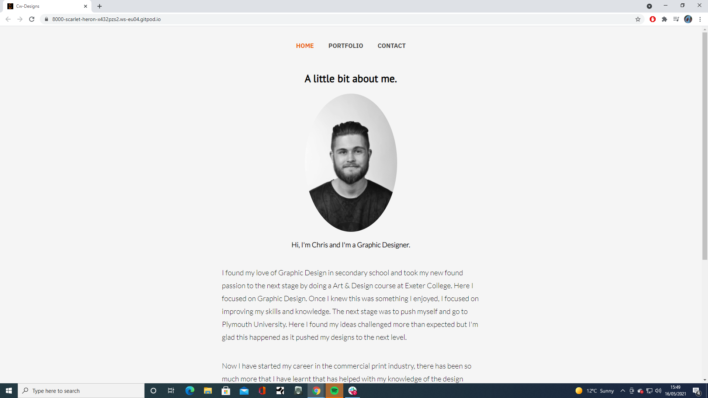

# MS-Project-one-JPT

 
 

## About

for my first MileStone project I wanted to do something simple, that would also allow me to apply the lessons I have learnt in CSS and html modules.
So I created a portfolio website for a graphics designer.

## Table of Content
* [ UX & UI](#my-ux-choices-and-my-ui-choices)
* [Features](#features)
* [Future Features](#future-features)
* [Tech Used](#technologies-used)
* [Testing](#testing)
* [Deployment](#deployment)

## my UX choices and my UI choices.

### UX justification. 
1. I wanted to create a clean looking website.
2. by doing this it allows the portfolio to create the colour.
3. by having a simple navigation it creates a pleasant user experience.
4. Having the main three pages target blank it makes it very easy to navigate through the whole site in three tabs
5. adding a hints of logo colours within the site allows the user to become familiar with the brand.
6. by adding in a portrait of the artist it creates a sense of safety as you know who it is you're working with

### UI Justification.
1.For my UI I have added colour changes to provide confirmation that the user is where they want to be for example on hover clickable parts will change colour.
2.I have created slow animations at .5s to provide a smooth transition.
3.I have added lots of line height for the text to allow the text to be easily legible. 

## Features.

1. I have a topnav that is very simple to use.
2. I have a flexbox layout of all the projects giving them two rows of 5 for desktop rows of 3 for tablets and 1 for phone.
3. it has a simple enquiry process with links ot social media at the bottom of every page.
4. a small bio for each portfolio project.  

### Future Features

The future holds many posibilities and I want to come back to this project. Do I know all the changes I would like to make to this website? No, but there are a few things
I would like to change and update;
 
 * I would like to add a interaction bar on either side of the webiste. 
 * I would like to actually impliment other langauges down the line to this project to make it more professional and ready for the real world

## Technologies used

HTML5. 
CSS3.

## Testing

For testing I went through a few things like the transition animations just to make sure that they all did the thing I wanted to do which was for each one to do it seperatley
This was hard as putting the correct "
" in the right place was everything as the transition was targetting a class that the portfolio was built around.
One issue I am still having is trying to seperate the Text from the portfolio image so that when the Image is hovered the Image fades out but I want the text to fade in
So that it is more clear where to click to go to the next page for the portfolio selected.

Testing out the "<a>" making sure that they were linked all to the right place was just a simple case of making sure that they were all leading to the right hyperlinks.
And that the hyperlinks were fullfilling the purpose set to them, and making sure the right ones had the target="_blank" and the right ones simply sent you back to either
 the portfolio, contact or home page. Whilst others lead to seperate portfolios, it quickly became apparent that for this website to work I couldn't incorporate thirteen target 
 blanks as having thirteen tabs open for one singular portfolio website is far too much.
 

    

 all of my HTML files pass the HTML validator. it just didn't offer the same copy and paste valid sticker as it did for CSS.
 
 ## Deployment 
 
 For deployment I became easy to go from the coding platform I used to github-gitpod as I use VS code the only issues I really ran into was changing the file target locations within the gitpod as the gitpod won't have access to my C: drive so I need to make it target the files within the gitpod to make it all work appropriatley.

